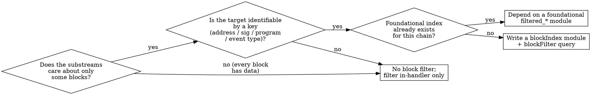

# Block & Transaction Filtering (Cost-Critical)

> **Read this whenever a Substreams only cares about a subset of blocks** — a
> specific contract, program, event signature, account, or transaction type.
> Defining a **block index filter** (`kind: blockIndex` + `blockFilter:`) lets
> the engine **skip blocks it never needs to process**. **Be aggressive about
> adding it.** If the data is sparse relative to all blocks, a block filter is
> almost always the right call.

---

## What you get

- **Lower cost** — you're billed for the blocks the engine actually processes.
  A contract active in 0.5% of blocks costs roughly 0.5% as much when filtered.
- **Much faster runs** — backfills and historical syncs drop from hours to
  minutes, because the engine jumps straight past irrelevant blocks.
- **Tighter iteration** — quicker rebuild/run cycles while developing, and a
  GUI progress bar that races across skipped ranges instead of crawling.
- **Less noise downstream** — your sink ingests only relevant blocks, so
  databases stay smaller and reorg handling has less to reconcile.

## How it works

A **block index** is a precomputed, per-block list of string *keys* describing
what each block contains (e.g. `evt_addr:0xdac17f...`). When a consuming module
declares a `blockFilter`, the engine evaluates a query against those keys
**before** processing the block. Blocks that cannot match are skipped entirely —
no read, no decode, no WASM execution — so you neither wait for them nor pay for
them. With precomputed indices the engine skips whole block segments at once, so
large irrelevant ranges disappear in one jump.

> **Real impact:** a contract that emits events in 0.5% of blocks turns a
> 10,000,000-block run into ~50,000 blocks of actual work — roughly 200× faster
> and cheaper.

---

## How block filtering works (the three pieces)

```
  source Block
      │
      ▼
  all_events (map)          ← extracts everything from the block
      │
      ├──────────────► index_events (kind: blockIndex)  ← emits Keys per block
      │                        │
      ▼                        ▼  (engine builds/reuses the cached index)
  filtered_events (map, with blockFilter: { module: index_events, query: ... })
                               ▲
                               └─ engine skips blocks whose keys don't match the query
```

1. **A producer module** (e.g. `all_events`) extracts candidate data from the
   raw block. (Optional — the index module can read the `Block` directly.)
2. **An index module** (`kind: blockIndex`) outputs
   `proto:sf.substreams.index.v1.Keys` — a `repeated string keys` of labels that
   describe the block's contents. These keys are cached per block.
3. **A consuming module** (`kind: map` or `kind: store`) declares a
   `blockFilter:` that references the index module and supplies a **query** over
   the keys. The engine runs the consuming module **only on blocks whose keys
   satisfy the query**.

### The `Keys` output type

```proto
// sf.substreams.index.v1
message Keys {
  repeated string keys = 1;
}
```

Keys are arbitrary strings **you choose**. Convention is `namespace:value`, e.g.
`evt_addr:0xdac17f...`, `evt_sig:0xddf252ad...`, `program:6EF8rr...`, or a bare
event-type string like `coin_received`. The query you write later must match
these exact strings.

---

## Manifest: the canonical pattern

```yaml
modules:
  # 1. Extract candidate data (optional — index can read Block directly)
  - name: all_events
    kind: map
    inputs:
      - source: sf.ethereum.type.v2.Block
    output:
      type: proto:my.types.v1.Events

  # 2. The index module — kind `blockIndex`, output `Keys`
  - name: index_events
    kind: blockIndex
    inputs:
      - map: all_events
    output:
      type: proto:sf.substreams.index.v1.Keys
    doc: |
      Emits `evt_addr:<address>` and `evt_sig:<topic0>` for every log in the block.

  # 3. The consuming module — declares blockFilter to skip non-matching blocks
  - name: filtered_events
    kind: map
    blockFilter:
      module: index_events            # name of the blockIndex module above
      query:
        string: "evt_addr:0xdac17f958d2ee523a2206206994597c13d831ec7"
    inputs:
      - map: all_events
    output:
      type: proto:my.types.v1.Events
```

> **The index is NOT applied automatically.** Declaring a `blockIndex` module
> and listing it as a dependency does **nothing** on its own. Skipping only
> happens for a module that has an explicit `blockFilter:` block. A module
> without `blockFilter` always runs on every block, even if an index module
> exists in the same package.

---

## The index module handler (Rust)

An index module is written with the **`map` handler macro** and returns `Keys`.
There is no separate `index` macro.

```rust
use substreams::errors::Error;
use substreams::Hex;
use crate::pb::sf::substreams::index::v1::Keys;

#[substreams::handlers::map]
fn index_events(events: Events) -> Result<Keys, Error> {
    let mut keys = Keys::default();
    for e in events.events {
        if let Some(log) = e.log {
            // signature (topic0) and contract address as keys
            if let Some(topic0) = log.topics.get(0) {
                keys.keys.push(format!("evt_sig:0x{}", Hex::encode(topic0)));
            }
            keys.keys.push(format!("evt_addr:0x{}", Hex::encode(&log.address)));
        }
    }
    Ok(keys)
}
```

Generate the `Keys` binding with `substreams protogen` after importing the
substreams package, or define the proto inline:

```proto
syntax = "proto3";
package sf.substreams.index.v1;
message Keys { repeated string keys = 1; }
```

---

## The query language (SQE)

The `blockFilter.query` is a **Substreams Query Expression**. It is a boolean
expression over the index keys. Operators (from `sqe/lexer.go`):

| Token | Meaning | Example |
|---|---|---|
| *(bare word)* | a key must be present | `evt_addr:0xdac17f...` |
| `&&` | logical AND | `evt_addr:0xA && evt_sig:0xB` |
| `\|\|` | logical OR | `evt_addr:0xA \|\| evt_addr:0xB` |
| `-` | logical NOT (prefix) | `evt_sig:0xtransfer && -evt_addr:0xspam` |
| `( )` | grouping | `(evt_addr:0xA \|\| evt_addr:0xB) && evt_sig:0xC` |
| `"` or `'` | quote a key with spaces/special chars | `"my key with spaces"` |

A bare key term matches a block when that **exact string** appears in the
block's `Keys`. Keys may contain `:`, `.`, hex, etc.; they may NOT contain
spaces, quotes, or parentheses unless quoted.

```yaml
# All USDT or USDC transfer-event blocks, excluding a known spam contract:
query:
  string: >-
    (evt_addr:0xdac17f958d2ee523a2206206994597c13d831ec7 ||
     evt_addr:0xa0b86991c6218b36c1d19d4a2e9eb0ce3606eb48) &&
    evt_sig:0xddf252ad1be2c89b69c2b068fc378daa952ba7f163c4a11628f55a4df523b3ef &&
    -evt_addr:0x00000000000000000000000000000000deadbeef
```

> **Match the key namespace exactly.** If the index emits `evt_addr:0x...`, your
> query must say `evt_addr:0x...` — not `address:0x...`. A namespace typo
> silently matches nothing, and the module emits no output.

### Two query forms

**Static (`string`)** — hard-coded in the manifest, good for fixed targets:

```yaml
blockFilter:
  module: index_events
  query:
    string: "program:6EF8rrecthR5Dkzon8Nwu78hRvfCKubJ14M5uBEwF6P"
```

**Runtime (`params: true`)** — the SQE expression is read from the module's
`params` input at run time, so consumers can change the filter without
rebuilding. Requires a `params` input on the module:

```yaml
- name: filtered_events
  kind: map
  blockFilter:
    module: index_events
    query:
      params: true            # ← query comes from the `params` input below
  inputs:
    - params: string
    - map: all_events
  output:
    type: proto:my.types.v1.Events
```

```yaml
# set the actual query at the top of the manifest or via --params:
params:
  filtered_events: "evt_addr:0xdac17f958d2ee523a2206206994597c13d831ec7"
```

```bash
substreams run substreams.yaml filtered_events \
  -s 18000000 -t +100000 \
  -p filtered_events="evt_addr:0xdac17f958d2ee523a2206206994597c13d831ec7"
```

Prefer `params: true` for reusable packages; prefer `string` for a single
fixed target.

### `use` inheritance

A module declared with `use:` inherits the used module's `blockFilter` when it
does not define its own. Set `blockFilter: {}` (empty) to explicitly clear an
inherited filter back to none.

---

## Foundational modules — don't reinvent them

Most chains ship a **foundational package** that already contains the index
modules **and ready-made `filtered_*` modules**. A `filtered_*` module applies
the `blockFilter` (block-level skip) **and** emits only the records that match —
so when you depend on one, the filtering is already done for you and there is
nothing to re-filter in your handler. Index outputs are also cached and shared
across runs, so for widely-used foundational modules the index has typically
already been computed by an earlier run and your stream reuses it.

**Prefer depending directly on a foundational `filtered_*` module.** Import with
a **full spkg URL** (short `name@version` currently 404s via the CLI — use
`spkg.io` / `api.substreams.dev`):

```yaml
imports:
  eth_common: https://spkg.io/v1/packages/ethereum-common/v0.3.3

modules:
  - name: map_my_data
    kind: map
    inputs:
      - map: eth_common:filtered_events   # already block-skipped AND event-filtered
    output:
      type: proto:my.types.v1.MyData

params:
  # REQUIRED — override the foundational default (see warning below).
  eth_common:filtered_events: "evt_addr:0xdac17f958d2ee523a2206206994597c13d831ec7"
```

`ethereum_common` v0.3.3 provides (key namespaces in parentheses):

| Module | Kind | Emits / filters on |
|---|---|---|
| `all_events` / `all_calls` | map | every event / call in the block |
| `index_events` | blockIndex | `evt_addr:`, `evt_sig:` |
| `index_calls` | blockIndex | `call_to:`, `call_from:`, `call_method:` |
| `index_events_and_calls` | blockIndex | all of the above |
| `filtered_events` / `filtered_calls` / `filtered_transactions` / `filtered_events_and_calls` | map | the matching events / calls / transactions |

Solana's `solana_common` v0.4.0 provides `blocks_without_votes`, the
`program_ids_without_votes` index (`program:<id>` keys), and the pre-filtered
`transactions_by_programid_without_votes` (and `..._and_account_...`) maps.

> **You MUST override the params query.** Every `filtered_*` module ships a
> *default* params filter (e.g. `ethereum_common`'s `filtered_events` defaults to
> a fixed `evt_sig:0x1730…`). If you don't override it you silently emit the
> default's data, not yours. Override it in your manifest `params:` (keyed by the
> imported module, e.g. `eth_common:filtered_events`) and, at minimum, per
> request with `-p eth_common:filtered_events="…"`. Match keys exactly —
> **0x-prefixed lowercase hex** (EVM addresses copied in checksum/mixed case will
> not match).

---

## Transaction / instruction / log filtering

**First choice: depend on a foundational `filtered_*` module.** As above,
`eth_common:filtered_events` / `filtered_calls` / `filtered_transactions` (and
Solana's `solana_common:transactions_by_programid_without_votes`) already apply
the `blockFilter` **and** return only the matching records — there is nothing to
re-filter in your handler. Reach for in-handler filtering only when you roll your
own `blockFilter` (no foundational module fits) or need finer precision than the
foundational module provides.

### EVM — when rolling your own

Prefer `eth_common:filtered_events` (above). If you must filter in-handler — a
custom output type, or a combination no foundational module covers — match on
**lowercase** address + signature:

```rust
const USDT: [u8; 20] = hex!("dac17f958d2ee523a2206206994597c13d831ec7");
const TRANSFER_SIG: [u8; 32] =
    hex!("ddf252ad1be2c89b69c2b068fc378daa952ba7f163c4a11628f55a4df523b3ef");

#[substreams::handlers::map]
fn map_transfers(block: Block) -> Result<Transfers, Error> {
    let mut out = Transfers::default();
    for trx in block.transactions() {
        for (log, _call) in trx.logs_with_calls() {
            if log.address == USDT
                && log.topics.get(0).map_or(false, |t| t == &TRANSFER_SIG)
            {
                out.items.push(extract_transfer(log));
            }
        }
    }
    Ok(out)
}
```

### Solana — transactions are pre-filtered, instructions are not

Depend on `solana_common:transactions_by_programid_without_votes` to receive only
the transactions that touch your program — block-skipped **and**
transaction-filtered for you, via its `program:<id>` params query:

```yaml
imports:
  solana_common: https://spkg.io/v1/packages/solana-common/v0.4.0

modules:
  - name: map_my_program
    kind: map
    inputs:
      - map: solana_common:transactions_by_programid_without_votes
    output:
      type: proto:my.types.v1.MyData

params:
  # REQUIRED — the default targets a different program
  solana_common:transactions_by_programid_without_votes: "program:6EF8rrecthR5Dkzon8Nwu78hRvfCKubJ14M5uBEwF6P"
```

**Instruction-level filtering within those transactions is still manual.** The
foundational module narrows you to the right transactions; you then iterate the
instructions yourself and keep the ones whose program id / discriminator you want
(see the **`substreams-solana`** skill for `walk_instructions()`).

---

## Decision guide — should I add a block filter?



**Add a block filter whenever the data you want is sparse** — a handful of
contracts/programs, specific event signatures, or a transaction type that
appears in a minority of blocks. Skip it only when essentially every block
contains data you need (e.g. per-block gas stats).

---

## Common mistakes

| Mistake | Consequence | Fix |
|---|---|---|
| Index module exists but no `blockFilter` on consumer | No skipping; full cost | Add `blockFilter:` to the consuming module |
| **Not overriding a foundational `filtered_*` module's default params** | Silently emits the *default* filter's data, not yours | Override at manifest level (`eth_common:filtered_events: "…"`) **and** at least per request (`-p eth_common:filtered_events="…"`) |
| **Address in checksum / mixed case** | Never matches — values are compared by literal equality | Use **0x-prefixed lowercase** hex (EVM checksum addresses must be lowercased) |
| Query namespace mismatch (`address:` vs `evt_addr:`) | Empty output, silent | Match the exact key prefix the index emits |
| Hand-rolling an index when a foundational `filtered_*` module exists | Wasted work; re-filtering already done for you | Depend on the foundational `filtered_*` module |
| Rolling your own `blockFilter` but expecting per-record filtering | Output includes unwanted records from kept blocks | Depend on a foundational `filtered_*` module, or also filter in-handler |
| Using `\|` or `and`/`or` words in SQE | Parse error | Use `\|\|`, `&&`, `-` |

---

## Verifying the win

Run with and without the filter over the same range and compare. The filtered
run reads far fewer blocks and finishes much faster:

```bash
# Unfiltered map over the raw range (reads/decodes every block):
substreams run substreams.yaml all_events -s 18000000 -t +100000

# Filtered consumer (engine skips non-matching blocks):
substreams run substreams.yaml filtered_events -s 18000000 -t +100000 \
  -p filtered_events="evt_addr:0xdac17f958d2ee523a2206206994597c13d831ec7"
```

Use `substreams gui` to watch the progress bar jump across skipped segments.
